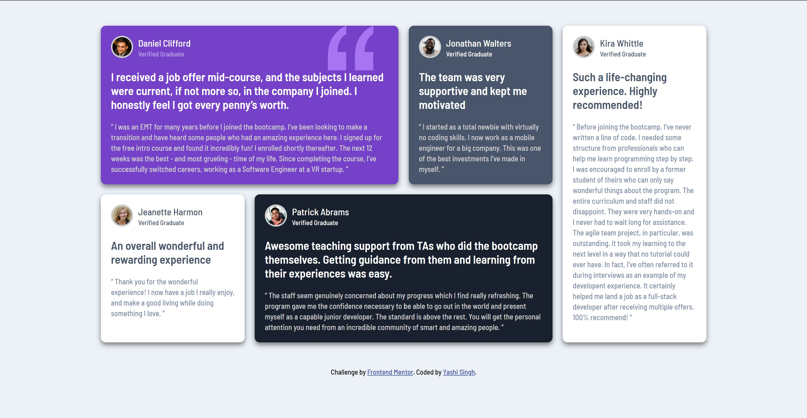
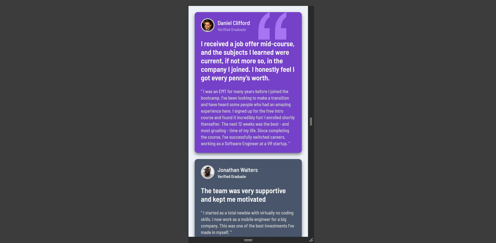

# Frontend Mentor - Testimonials Grid Section Solution

This is a solution to the [Testimonials Grid Section challenge on Frontend Mentor](https://www.frontendmentor.io/challenges/testimonials-grid-section-Nnw6J7Un7). Frontend Mentor challenges help you improve your coding skills by building realistic projects.

## Table of Contents

- [Overview](#overview)
  - [The Challenge](#the-challenge)
  - [Screenshot](#screenshot)
  - [Links](#links)
- [My Process](#my-process)
  - [Built With](#built-with)
  - [What I Learned](#what-i-learned)
  - [Continued Development](#continued-development)
  - [Useful Resources](#useful-resources)
- [Style Guide](#style-guide)
- [Author](#author)
- [Acknowledgments](#acknowledgments)

## Overview

### The Challenge

Users should be able to:

- View the optimal layout for the site depending on their device's screen size.

### Screenshot

### Links

- [Solution URL](https://www.frontendmentor.io/solutions/testimonials-grid-section-lqxEio8xC7)
- [Live Site URL](https://testimonials-grid-section-solutions.netlify.app/) 

## My Process

### Built With

- Semantic HTML5 markup
- CSS custom properties
- Flexbox
- CSS Grid
- Mobile-first workflow

### What I Learned

This project was a great opportunity to enhance my skills with CSS Grid and Flexbox, especially in creating responsive layouts. I learned how to effectively manage different grid layouts depending on the screen size using media queries.

### Continued Development

In future projects, I would like to continue refining my skills in:

- Advanced CSS techniques like CSS Grid and Flexbox.
- Creating more complex, responsive layouts that work seamlessly across various devices.
- Exploring CSS preprocessors like SASS to streamline my styling process.

### Useful Resources

- [CSS Tricks - A Complete Guide to Grid](https://css-tricks.com/snippets/css/complete-guide-grid/) - This resource was invaluable for understanding and implementing CSS Grid.
- [MDN Web Docs - Responsive Design](https://developer.mozilla.org/en-US/docs/Learn/CSS/CSS_layout/Responsive_Design) - This helped me brush up on responsive design concepts.

## Style Guide

The styles that I have used please refer to [Style Guide](style-guide.md)

## Author

- Frontend Mentor - [@Yashi-Singh-1](https://www.frontendmentor.io/profile/Yashi-Singh-1)
- LinkedIn - [Yashi Singh](https://www.linkedin.com/in/yashi-singh-b4143a246)

## Acknowledgments

I would like to thank the Frontend Mentor community for providing valuable feedback and inspiration throughout this project.
